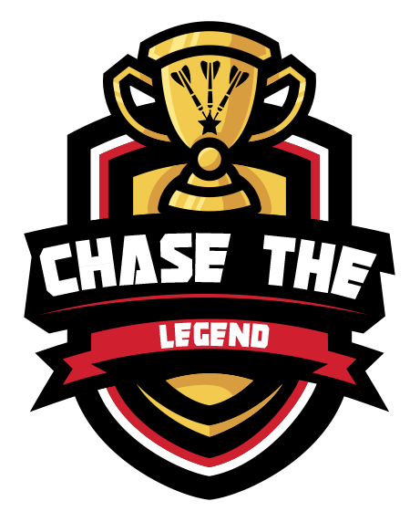

# Chase The Legend

**Based on Around The Clock, Chase The Legend is a solo competitive darts game that is a fun and exciting way to practice darts.**

# How to play

Starting with the first match (Legend #1), the Player must chase a Legend around the dartboard in numerical order using 3 darts per Round. First one to 20 wins.

In each match the Player must begin with number 1 on the dartboard. The Legend will start on their corresponding number. Once the Player has successfully hit the correct number, the Player progresses to the next number on the dartboard. The Legend automatically moves up one number per Round.

Battle each Legend in order and only progress to the next match once a Legend has been beaten.

### Bonus Streak

Earn bonus throws each time the Player hits 3 numbers in a row (in a Round). Continue the Streak until the Player misses the next required number. When the Bonus Streak is over - Reset and start the next Round. Bonus Streak’s are essential when playing higher ranked Legend’s.

### Winning
The Player wins a match by either hitting 20 before or in the same Round as the Legend. There are no draws in Chase The Legend. If the Legend reaches 20 first and the Player cannot hit 20 in the same Round, the Player has lost and will need to replay that Legend to progress to the next match.

### Levels

- **Rookie**: Hit Singles, Doubles (Bonus Skip 2 numbers) or Trebles (Bonus Skip 3 numbers).
- **Amateur**: Hit Singles, Doubles or Trebles.
- **Pro**: Hit Doubles or Trebles only.
- **Superhero**: Hit Trebles only.
- **God mode**: Blind folded.

### Tip

Keep a mental note of the score throughout a match by always stating the Players score first,
eg. Legend #6, end of Round 1, Player misses 1 with all 3 darts - the current score is: **1:6**

# Download, Print, Play

Download the latest files from the **Releases** section for all the documentation you need to play this game.

- **Chase The Legend poster**: Print out this full colour guide and look your opponent in the eye as you sore to victory.
- **Chase The Legend Scoreboard**: Track all of your wins, also contains Quick Start Rules.

# Legend's Ranking

Two websites were used to fairly decide the rank of each Legend;

- **Upcoming Legends**: https://www.pdc.tv/order-of-merit/pdc-order-merit
- **All Time Legends**: https://news.williamhill.com/darts/ten-greatest-darts-players-of-all-time

The resources for this game will be updated periodically when ranks change.

# History

I first created this game when I was a kid sometime in the early 1990's. In those days I wrote the Legend's down on scraps of paper, with the great John Lowe being the top guy. Fast forward a few decades later, a new dartboard and many hours of Photoshop'in - I recreated this game here. Firstly to learn to throw again after a lengthy break and secondly to share this game with the community for others to enjoy.

# FAQ

### 1. How many Rounds are there?

The number of Rounds depends on the Legend's level, eg. Legend #1 = 20 Rounds, Legend #2 = 19 Rounds, Legend #3 = 18 Rounds, etc.

### 2. Can a Legend score during a Bonus Streak?

No. The Legend's scoring freezes during a Players streak.

### 3. What happens if a Player misses with all 3 darts in a Round?

The match continues to the next Round where the Legend automatically progresses to their next number and the Player re-attempts their current number.

### 4. Can a Player hit more than one number per Round?

Yes. As soon as a Player hits the correct number, they move directly onto the next number with their next dart.

### 5. Is commentating during a match in the style of a TV commentator a sign of madness?

No! Chase The Legend can be an exciting game, so have fun with it :)

# Sharing

To promote this Github and to make sure the latest files are in use - when sharing this game, please do not share the files themselves, please share the link to this Github instead: **github.com/anthonywithah/chase-the-legend**

# Supporting Media

Thank you to the following free graphic and media resources for making my life easier;
- **Logo source**: vecteezy.com/vector-art/7681089-esports-logo-template-with-trophy-for-gaming-team-or-tournament
- **Font**: dafont.com/strongarm.font
- **Font**: fontawesome.com

# Pathway to Open Source

I would love to make this project fully Open Source one day. So once this project has been fully developed with enough community feedback, it will be released as Open Source, with all supporting files and documentation.

### "LET'S. PLAY. DARTS! Player to throw first"
