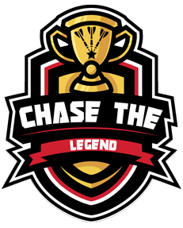
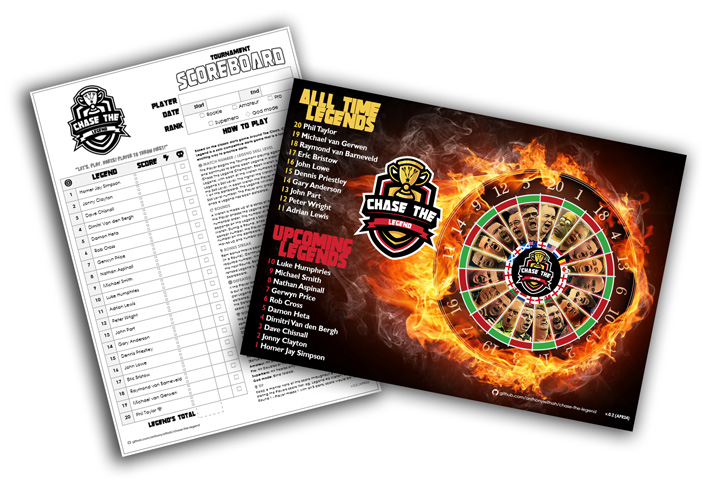
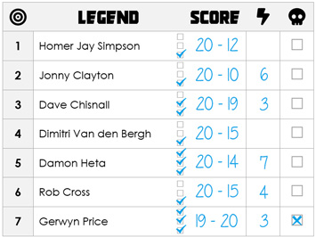
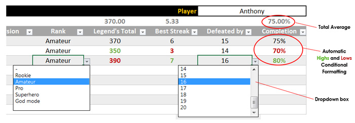

> ### :dart: BETA: Looking for testers and feedback - Please add your [Issues](https://github.com/anthonywithah/chase-the-legend/issues), [Ideas](https://github.com/anthonywithah/chase-the-legend/issues) and [Feedback](https://github.com/anthonywithah/chase-the-legend/discussions) to help improve this game for everyone. Thank you.

 
  

# CHASE THE LEGEND

**Based on the classic darts game Around The Clock, Chase The Legend is a solo competitive darts game that is a fun and exciting way to practice darts.**

## How To Play

> :dart: **Don't forget to [Download](https://github.com/anthonywithah/chase-the-legend/releases) your Chase The Legend Scoreboard and Poster!**

### Match Number / Legend Skill Level

The Player begins the Tournament playing against Legend #1 and continues to battle each Legend in order to become Chase The Legend Champion. Each Match is assigned a darts Legend, with each of the Match numbers corresponding to the Legend’s Skill Level. The higher the Match number, the higher the Skill Level. In each Match the Player must begin with number 1 on the dartboard. The Legend will start on their corresponding Skill Level number. The Player only progresses to the next Match once a Legend has been defeated.

### Rounds
A Match is made up of a series of standard 3 dart Rounds, where the Player chases the Legend around the dartboard in numerical order. The number of Rounds played in each Match depends on the Legend’s Skill Level: eg. Legend #9 = 12 Round Match. During a Round, once the Player successfully hits the correct number, the Player immediately progresses to the next number on the dartboard. Whereas the Legend automatically moves up one number per Round.

### Bonus Streak
Earn bonus throws each time the Player hits 3 numbers in a row (in a Round). Continue the Streak until the Player misses the next required number. When the Bonus Streak is over - Reset and start the next Round. Bonus Streak’s are essential when playing higher ranked Legend’s. Add your best Streak per Match to the Scoreboard.

### Defeated
If the Player loses 3 Matches in a row, the Player is defeated and is out of the tournament. Track the number of Matches played per Legend using the Stacked Tick Boxes. When a Player is defeated, add a cross to the Legend that defeated the Player in the Defeated column. For the purpose of the final Legend’s Total score - all remaining Legend’s score the maximum 20.

### Winning
The Player wins a match by either hitting 20 before or in the same Round as the Legend. There are no draws in Chase The Legend. If the Legend reaches 20 first and the Player cannot hit 20 in the same Round, the Player is defeated and will need to replay that Legend to progress to the next Match. The Player can only be crowned Chase The Legend Champion upon defeating all Legend’s in a Tournament.

### Rank

- **Rookie**: Hit Singles, Doubles (Bonus Skip 2 numbers) or Trebles (Bonus Skip 3 numbers).
- **Amateur**: Hit Singles, Doubles or Trebles.
- **Pro**: Hit Doubles or Trebles only.
- **Superhero**: Hit Trebles only.
- **God mode**: Blind folded.

### Tip

Keep a mental note of the score throughout a Match by always stating the Players score first: eg. Legend #6 Match, end of Round 1 - Player misses 1 with all 3 darts, score would be: **1:6**

 

# Download, Print, Play

Download the latest files from the [**Releases**](https://github.com/anthonywithah/chase-the-legend/releases) section for all the documentation you need to play this game.

- **Chase The Legend Poster**: Print this full colour guide and look your opponent in the eye as you sore to victory.
- **Chase The Legend Scoreboard**: Print and track all of your wins, also contains Quick Start Rules.
- **Chase The Legend Tracker**: Transfer your Scoreboard data to this spreadsheet, to keep track of all of your Tournaments.

# Legend's Ranking

Two websites were used to fairly decide the rank of each Legend;

- **Upcoming Legends**: https://www.pdc.tv/order-of-merit/pdc-order-merit
- **All Time Legends**: https://news.williamhill.com/darts/ten-greatest-darts-players-of-all-time

The resources for this game will be updated periodically to adjust for rank changes.

| Version       | Rank date   |
| :-----------: | :---------: |
| v.0.1         | Mar 2024    |
| v.0.2         | Mar 2024    |

# History

I first created this game when I was a kid sometime in the late 1980's. In those days I wrote the Legend's down on scraps of paper, with the great John Lowe being the top guy. Fast forward a few decades later, a new dartboard and too many hours of Photoshop'in - I recreated this game here. Firstly to learn to throw again after a lengthy break and secondly to share this game with the community for others to enjoy.

# FAQ

### 1. How many Rounds are there?

The number of Rounds depends on the Legend's level, eg. Legend #1 = 20 Rounds, Legend #2 = 19 Rounds, Legend #3 = 18 Rounds, etc.

### 2. Can a Legend score during a Bonus Streak?

No. The Legend's scoring freezes during a Players streak.

### 3. What happens if a Player misses with all 3 darts in a Round?

The match continues to the next Round where the Legend automatically progresses to their next number and the Player re-attempts their current number.

### 4. Can a Player hit more than one number per Round?

Yes. As soon as a Player hits the correct number, they move directly onto the next number with their next dart.

### 5. Is commentating during a match in the style of a TV commentator a sign of madness?

No! Chase The Legend can be an exciting game, so have fun with it :)

# Made With

- **Chase The Legend Scoreboard**: Microsoft Word
- **Chase The Legend Poster**: Adobe Photoshop
- **Chase The Legend Tracker**: Microsoft Excel
- **Chase The Legend Logo**: Adobe Illustrator and PhotoShop

# Graphic Sources

Thank you to the following free graphic and media resources for making my life easier (sources backed-up in ).
- **Logo source**: vecteezy.com/vector-art/7681089-esports-logo-template-with-trophy-for-gaming-team-or-tournament
- **Logo font**: dafont.com/strongarm.font
- **Logo dart**: game-icons.net/1x1/delapouite/dart.html
- **Logo star**: iconmonstr.com/star-3-svg
- **Poster background**: pxfuel.com/en/desktop-wallpaper-pbcwm
- **Poster dartboard wire**: vecteezy.com/vector-art/18881920-dart-board-in-flat-style
- **Poster flags**: wikipedia.org
- **Scoreboard icons**: fontawesome.com
- **Scoreboard speech font**: fontspace.com/blowhole-bb-font-f16753

# Questions, Issues, Ideas and Feedback

- [**Issues**](https://github.com/anthonywithah/chase-the-legend/issues): Bugs, Errors, Typos, Improvements and Ideas.
- [**Discussions**](https://github.com/anthonywithah/chase-the-legend/discussions): Questions and Feedback.

# Sharing

For full community transparency and to help promote this Github, making sure the latest files are in use - When sharing this game, please do not share the files themselves or duplicate this Readme, instead please share the link to this Github: **github.com/anthonywithah/chase-the-legend**

# Pathway to Open Source

I would love to make this project Open Source one day. So after this project has been fully developed with enough community feedback, it will be released as Open Source.

Chase The Legend is a free to use game download, designed by me (Anthony) - March 2024.

> ### :dart: "LET'S. PLAY. DARTS! Player to throw first."
